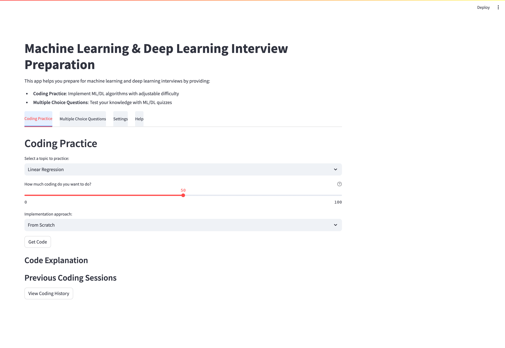
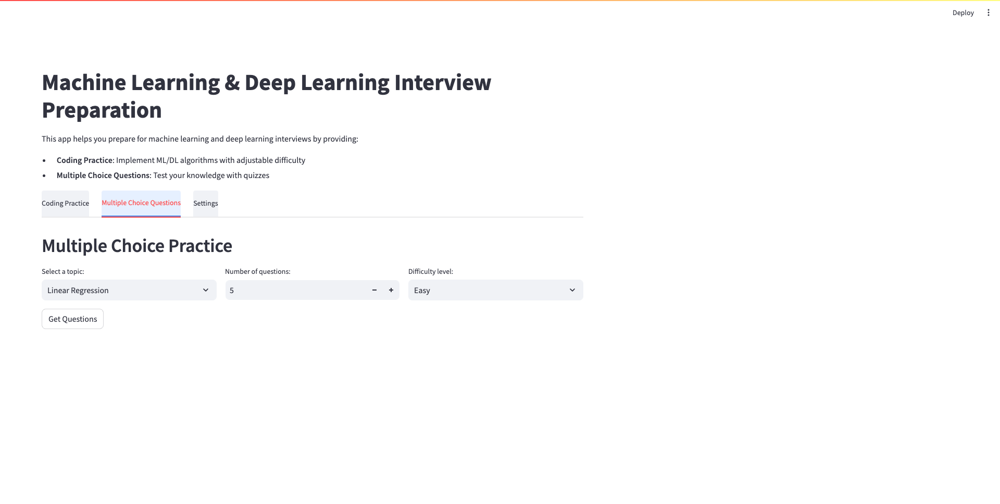
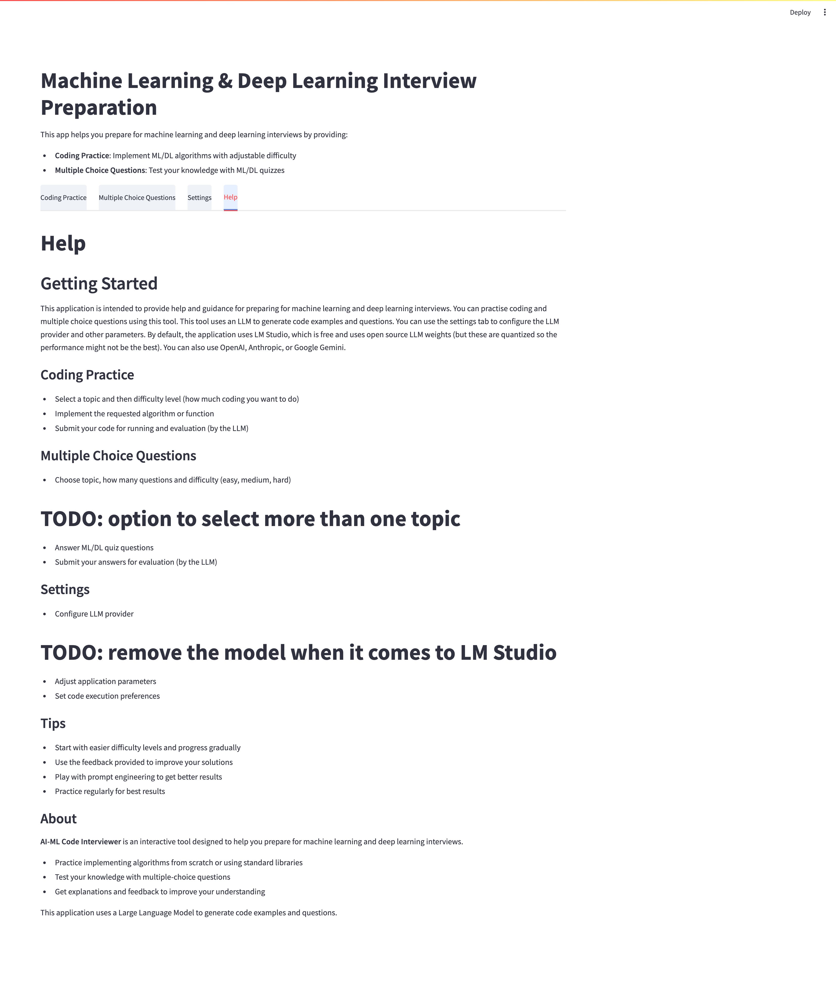

# Machine Learning & Deep Learning Interview Preparation App

<div align="center">
  
</div>

This app is built using Streamlit and provides interactive coding and multiple-choice question practice for machine learning and deep learning topics. It is designed to help interview candidates practice key concepts, algorithms, and techniques by generating coding challenges and questions on-demand.

## Features

- **Coding Practice**
  - Choose from a list of top ML and DL algorithms and concepts (e.g., Linear Regression, K-Means, Self Attention). #TODO: Add more algorithms and concepts, perhaps add a free flowing text field
  - Set a coding intensity level to determine how much of the code you want to write yourself (from 0% to 100%).
  - Choose to implement the algorithm from scratch or using standard libraries (e.g., `scikit-learn` for machine learning algorithms).
  - Receive generated code from a Large Language Model (LLM) that matches the selected intensity level.
  - Edit, run, and test the code directly in the Streamlit app, mimicking an IDE-like experience.
  - Use "Explain This Code" to get a detailed explanation of the code.

- **Multiple Choice Questions**
  - Select the number of questions and difficulty level (easy, medium, or hard).
  - Practice answering multiple-choice questions generated by an LLM on the selected topic.
  - Get instant feedback on answers with color-coded results.
  - Review your final score at the end of each quiz.
  - Request explanations for questions to deepen your understanding.

- **New Features**
  - Improved code syntax highlighting
  - Safer code execution environment
  - Better error handling for LLM responses
  - Configurable settings via environment variables
  - Enhanced UI with responsive design

## Project Structure

```
ai-ml-code-interviewer/
├── app.py                 # Main application entry point
├── coding_module.py       # Coding practice functionality
├── help_module.py         # Help and documentation functionality
├── history_manager.py     # Session history management
├── quiz_module.py         # Quiz functionality
├── llm_service.py         # LLM API interaction service
├── code_executor.py       # Safe code execution environment
├── settings_module.py     # Settings management
├── utils.py               # Utility functions
├── config.py              # Configuration settings
├── requirements.txt       # Project dependencies
├── dev-requirements.txt   # Development dependencies
├── .env.example           # Example environment variables
├── styles/                # CSS styles
│   └── app.css           # Application styles
├── user_history/          # Session history files
├── .github/               # GitHub workflow files
├── .pre-commit-config.yaml# Pre-commit configuration
└── Readme.md              # Project documentation
```

## Installation

To set up and run this app locally, follow these steps:

1. **Clone the repository**:

    ```bash
    git clone https://github.com/analyticsbot/deep-learning.git
    cd ai-ml-code-interviewer
    ```

2. **Install dependencies**:

    Make sure you have Python 3.7+ installed. First, create and activate a virtual environment:

    ```bash
    # Create virtual environment
    python -m venv venv

    # Activate virtual environment
    # On Windows:
    venv\Scripts\activate

    # On macOS/Linux:
    source venv/bin/activate
    ```

    Install the required packages:

    ```bash
    pip install -r requirements.txt
    ```

3. **Set up environment variables**:

   Copy the `.env.example` file to `.env` and update the settings as needed:

   ```bash
   cp .env.example .env
   ```

   Edit the `.env` file to configure your LLM API keys based on which provider you want to use:

   ```
   # For OpenAI
   OPENAI_API_KEY=your_openai_key_here

   # For Anthropic
   ANTHROPIC_API_KEY=your_anthropic_key_here

   # For Google Gemini
   GOOGLE_API_KEY=your_google_key_here

   # For Grok
   GROK_API_KEY=your_grok_key_here
   ```

   **IMPORTANT**: The `.env` file contains sensitive API keys and should NEVER be committed to version control. It is already included in the [.gitignore](/ai-ml-code-interviewer/.gitignore) file. DO NOT remove it from [.gitignore](/ai-ml-code-interviewer/.gitignore) as this would expose your API keys to others.

   All other configuration settings (LLM_PROVIDER, LLM_BASE_URL, LLM_MODEL, LLM_TEMPERATURE) are stored in the [.app_settings.json](/ai-ml-code-interviewer/.app_settings.json) file, which is safe to commit as it does not contain any sensitive information.

   **WARNING**: NEVER share your `.env` file or commit it to any public repository. Always keep it secure and private.

4. **Run the Streamlit app**:

   ```bash
   streamlit run app.py
   ```

## Usage

### Coding Practice

1. Navigate to the "Coding Practice" tab
2. Select a topic from the dropdown menu (e.g., "Linear Regression")
3. Adjust the coding intensity slider (0% for full code, 100% for skeleton)
4. Choose implementation approach ("From Scratch" or "Using Standard Package")
5. Click "Get Code" to generate code from the LLM
6. Edit the code in the text area
7. Click "Run Code" to execute and see results
8. Use "Explain This Code" to get a detailed explanation

### Multiple Choice Questions

1. Navigate to the "Multiple Choice Questions" tab
2. Select a topic, number of questions, and difficulty level
3. Click "Get Questions" to generate a quiz
4. Select your answers for each question
5. Click "Submit Answers" to check your results
6. Review your score and correct/incorrect answers
7. Click "Explain" buttons to get explanations for specific questions
8. Use "Start New Quiz" to generate a new set of questions

<div align="center">
  
</div>

### Settings

The "Settings" tab allows you to:

- View current LLM configuration
- Toggle code execution (for security reasons)
- Learn more about the application

<div align="center">
  
</div>

### Help

The "Help" tab provides detailed documentation and guides for using the application.

<div align="center">
  
</div>

## Security Features

- Code execution is disabled by default for security (can be enabled in settings)
- Restricted execution environment when running user code
- Input validation and sanitization for LLM prompts
- Error handling for LLM API calls

## Dependencies

- `streamlit>=1.22.0`: Interactive UI framework
- `requests>=2.28.2`: HTTP requests
- `openai>=1.0.0`: OpenAI-compatible API client
- `python-dotenv>=1.0.0`: Environment variable management
- `pydantic>=2.0.0`: Data validation
- `markdown>=3.4.3`: Markdown processing
- `pygments>=2.15.0`: Code syntax highlighting
- `anthropic>=0.5.0`: Anthropic API client (optional)
- `google-generativeai>=0.3.0`: Google Gemini API client (optional)
- `streamlit_ace>=0.1.0`: Code editor component for Streamlit

## Troubleshooting

### LLM Server Issues

- Ensure your LM Studio server is running at the configured endpoint, if you're using the local server
- For the LLM such as OpenAI, Anthropic, and Google Gemini, verify API key is configured in the `.env` file

### Code Execution Problems

- Make sure code execution is enabled in settings if you want to run code
- Check for syntax errors in your code
- Some libraries may not be available in the restricted execution environment

### UI Issues

- Try refreshing the page if UI elements are not responding
- Check Streamlit version compatibility

## Contributing

Contributions are welcome! Please follow these steps:

1. Fork the repository
2. Create a feature branch (`git checkout -b feature/amazing-feature`)
3. Make your changes
4. Commit your changes (`git commit -m 'Add some amazing feature'`)
5. Push to the branch (`git push origin feature/amazing-feature`)
6. Open a Pull Request

## License

This project is licensed under the MIT License - see the LICENSE file for details.
